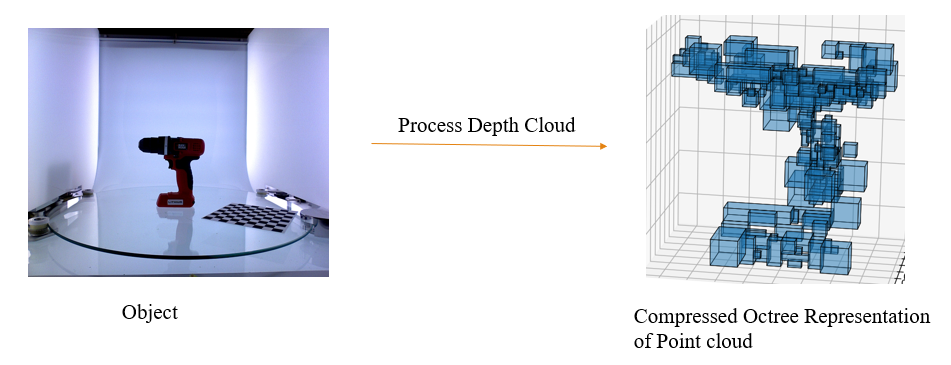
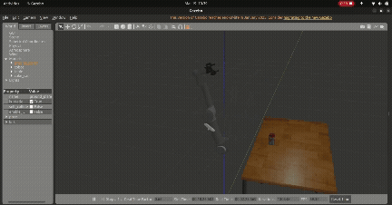

# An Improved Vision-guided Manipulation Framework for robotic grasping

(Code and real-world demonstration coming soon!)

This repository contains details for a pipeline for vision-guided manipulation for complex objects. The vision pipeline leverages an optimized and efficient Octree partitioning approach of object point cloud by analyzing point cloud spread in voxels. This results in a significantly lighter Octree representation, with object clues. This aids in creating a effective grasping pipeline using antipodal and heirarchical grasping appraoches, resulting in better and more successful grasping. 

    

The gif below shows a demonstration of the grasping framework on grasping an object in a **custom made Gazebo simulation** environment.

    

